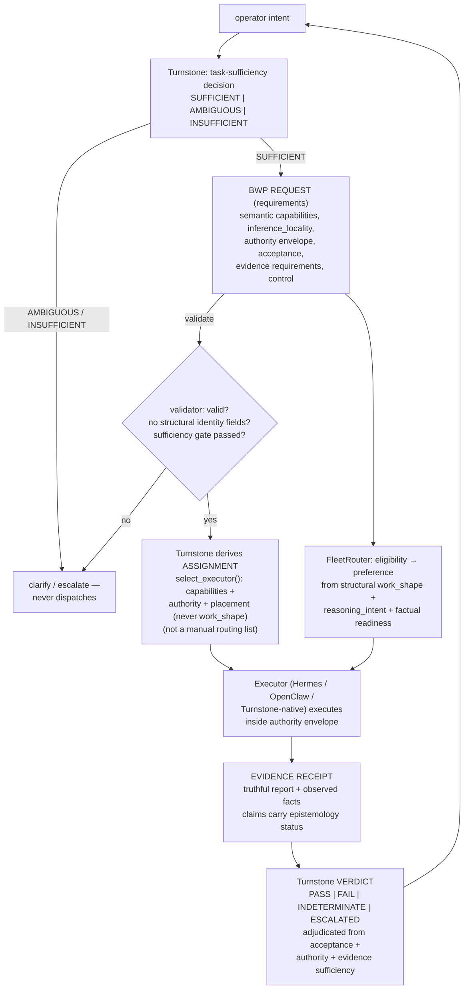

# Fleet Governance v1 — Architecture / Design Document

**Status:** DESIGN-ARTIFACT MILESTONE (authorized 2026-08-22). **NOT integrated / activated / deployed.**
**Author:** Turnstone (control plane / outcome owner). **Reviewer gate:** Vincent; then one independent material review before runtime integration.

---

## 0. Executive summary

Fleet Governance v1 establishes the **Bounded Work Packet (BWP)** contract — a validated, structural
object family that makes Turnstone a disciplined producer of **work requirements** for the now-production
FleetRouter/execution fabric.

The core conclusion, confirmed by Vincent: **the BWP is a consolidation/structuralization of existing
Turnstone governance primitives, not a new control plane, task lifecycle, router, or evidence system.**

The design introduces **four distinct schema objects** (REQUEST / ASSIGNMENT / RECEIPT / VERDICT) sharing
provenance, a **deterministic validator** with a sufficiency gate and rejection rules, and explicit
**ownership boundaries** that prevent authority leakage. It changes **no runtime behavior**.

---

## 1. Context and baseline

- **Switchyard S2-H production baseline is CLOSED and authoritative** (2026-08-22): binary `97f37f96…`,
  routes `ac57f4c5…`, PID 1431983, 28 routes, PR #10 open/draft/unmerged. Not reopened.
- FleetRouter performs **deterministic resource selection from declared work requirements**:
  task/work requirement → capability → readiness → context fit → eligible candidates → preference.
  Preference **never** rescues an ineligible candidate.
- Turnstone semantic aliases (`switchyard-smart-bounded/agentic/reasoning`) are **work-class pins**,
  not raw provider selections. `work_shape × reasoning_intent` flows structurally via `extra_body`
  (request-sourced, never prompt prose).
- Existing primitives reused (not re-invented): workstreams (lifecycle + evidence trail),
  `task_agent` required `work_shape`, adaptive-ingress contract mapping, delegation envelope minimums,
  archived `delegation_envelope.example.json` (2026-07-16, mined for shape), evidence epistemology,
  mutation ledger, self-dependency guard.

## 2. The architectural gap being closed

| Gap | Before | After (v1 design) |
|---|---|---|
| No canonical packet object | Envelope = prose conventions in skills | Validated BWP schema family with deterministic rules |
| No deterministic sufficiency gate | Ambiguous requests could reach executors | `intent.sufficiency` gate: only `SUFFICIENT` dispatches; AMBIGUOUS/INSUFFICIENT → clarify/escalate |
| Resource requirements undeclared | work_shape only; rest implicit | Capabilities (semantic), context seams, locality, output budget, authority envelope |
| Completion/verdict conversational | "PASS" in reports, not structural | Verdict object with deterministic adjudication + receipt linkage |

**What would create duplication (explicitly avoided):** a parallel task lifecycle (workstreams own it),
a second routing mechanism (FleetRouter owns it), a provider-selection layer (forbidden), a new
evidence store (evidence states + ledger + workstream export exist).

## 3. Architectural flow



**Core doctrine: Turnstone governs intent; FleetRouter governs resource selection.**

## 4. The four lifecycle objects

All four share `packet_id` + `correlation_id` + `workstream_id`. Ownership and timing are explicit.

### 4.1 BWP REQUEST (Requirements) — Turnstone-authored, operator-authorized

Owns: intent/outcome, non-goals, **task sufficiency**, **work shape** (bounded|agentic),
**reasoning intent** (none|deliberate), **required capabilities** (semantic vocabulary),
**resource requirements expressed abstractly** (inference_locality, context, output budget),
**authority envelope** (risk class, allowed/forbidden actions, mutation envelope),
**acceptance criteria**, **evidence requirements**, **control** (timeout/cancel/escalation).

**Forbidden in the REQUEST:** provider/model/resource identity encoded STRUCTURALLY (forbidden identity keys in requirement fields; capabilities outside the semantic vocabulary — both hard-rejected), prompt prose as routing truth (prose mention of identities is warning-only; structural `work` fields are the ONLY routing source), manually authored lane lists (schema has none).

### 4.2 ASSIGNMENT — Turnstone-derived at dispatch

Owns: selected executor, **derivation rationale** (from capabilities + authority + placement
constraints — NOT a manual routing list and NOT work_shape), run/correlation IDs, delegation-envelope
reference, structured metadata handoff (work_shape/reasoning_intent) that flows to executor ingress.

The ASSIGNMENT records who was picked and why. It never picks a provider/model.

**Executor selection is NOT a second router.** Two strictly separate decision chains:

```text
BWP capability + authority requirements
    -> derive_executor_candidates()   (executor eligibility)
    -> select_executor()              (Turnstone / Hermes / OpenClaw assignment)

BWP work_shape + reasoning_intent
    -> Switchyard / FleetRouter       (inference resource eligibility + preference)
```

`work_shape` / `reasoning_intent` describe INFERENCE SEMANTICS for the FleetRouter chain only. They
NEVER select an executor: there is **no mechanical `agentic → Hermes` or `bounded → Turnstone/OpenClaw`
mapping**. Executor selection derives from required capabilities, authority/risk, available execution
surfaces, and operator/governance gates. `inference_locality` is a RESOURCE constraint
for the FleetRouter chain only and NEVER selects an executor.

### 4.3 EVIDENCE RECEIPT — executor-produced + observed

Owns: executor that actually ran, actions actually taken, produced artifacts (paths + hashes),
run IDs / ledger refs, failures/uncertainties, and — **where observable — the actual
resource/model/provider that executed** (routing telemetry, journal, logs), plus the **observed
inference-resource locality** (`local | hosted | unknown`) from authoritative telemetry. Each
evidence claim carries an **epistemology status** (`PROVEN / PROPOSED / ASSUMED / FAILED /
INDETERMINATE`) and optional `criterion_refs` (references to the REQUEST acceptance criteria the
claim positively adjudicates).

**The actual Switchyard-selected inference resource is an observed receipt fact, never a BWP input.**
**Provider/model names never establish locality — only the observed `locality` fact does.**

### 4.4 VERDICT — Turnstone-adjudicated afterward

Owns the **work outcome**: `PASS / FAIL / INDETERMINATE / ESCALATED`, with basis and closeout
(workstream state, receipt links, escalation ref).

**Per-criterion acceptance adjudication (direct-review correction 3):** every acceptance criterion
is adjudicated explicitly by Turnstone from evidence:

```text
criterion: {id/statement, status: MET | NOT_MET | INDETERMINATE, evidence_refs, rationale}
```

- **MET** only from a **positive PROVEN evidence claim** referencing the criterion (`criterion_refs`);
- **NOT_MET** from a FAILED evidence claim referencing the criterion;
- **INDETERMINATE** otherwise — **no criterion may become MET merely because no FAILED claim exists**;
- the executor's `acceptance_self_assessment` is **advisory only, never authoritative**.

## 5. Evidence epistemology vs work outcome (explicitly separate)

| Vocabulary | Applies to | Values |
|---|---|---|
| **Evidence epistemology** | Claims in the RECEIPT (and verdict basis) | `PROVEN`, `PROPOSED`, `ASSUMED`, `FAILED`, `INDETERMINATE` |
| **Work outcome** | Turnstone's overall verdict | `PASS`, `FAIL`, `INDETERMINATE`, `ESCALATED` |

Rules:
- A receipt may contain many **individually PROVEN** claims and still produce an overall **FAIL**
  verdict (e.g., proven that the wrong thing was done).
- **PASS** requires: ALL acceptance criteria explicitly **MET** from positive PROVEN evidence AND
  authority compliance AND **evidence sufficiency** (all BWP evidence requirements satisfied; no
  blocking INDETERMINATE claim) AND hard constraints satisfied.
- **FAIL** when: any acceptance criterion NOT_MET, or authority violation, or proven hard-constraint
  violation.
- **INDETERMINATE** when evidence is insufficient to adjudicate (missing required evidence, blocking
  INDETERMINATE claim, a required criterion not positively adjudicated, or an unverifiable hard
  constraint) and no FAIL condition is proven.
- **ESCALATED** when the authority/uncertainty boundary is crossed (forbidden action attempted,
  acceptance criteria changed mid-flight, packet exceeds granted authority, or operator gate required).

**Hard-constraint adjudication uses OBSERVED locality (direct-review correction 2):**

| `inference_locality` | Observed `resource_observed.inference_resource.locality` | Result |
|---|---|---|
| `local_required` | `hosted` (PROVEN) | **VIOLATED → FAIL** |
| `local_required` | `local` (PROVEN) | compliant (SATISFIED) |
| `local_required` | `unknown` or absent (unproven) | **UNVERIFIABLE → INDETERMINATE** (never inferred FAIL) |
| `hosted_allowed` / `any` | any | no locality constraint |

Provider/model presence never establishes locality; the observed `locality` fact comes from
Switchyard/resource telemetry or another authoritative factual source — no second
readiness/resource-classification system is invented.

The adjudicator is deterministic: it maps per-criterion acceptance/authority/evidence/observed
constraints into the outcome using these rules.

## 6. Hard requirements vs preferences

Generalized FleetRouter doctrine upward:

> **Hard requirements determine eligibility/legal execution.**
> **Preferences operate only among already-eligible choices.**
> **A preference can never rescue an invalid option.**

- **Hard (in REQUEST):** `work_shape`, `reasoning_intent`, `capabilities_required`, `inference_locality`,
  context constraints, authority envelope (risk class, allowed/forbidden actions), acceptance,
  evidence requirements.
- **Preferences (in REQUEST, reserved):** `requirements.preferences[]` with `active: false` for v1
  (latency/cost). The validator rejects any packet where a preference is active, and the
  eligibility function **never consults preferences** (unit-proven: ineligible remains ineligible
  regardless of preference).

### 6a. Hard-requirement support audit (v1) — direct-review #5000030053

A hard requirement must be **enforced BEFORE execution** by the current production
Switchyard/FleetRouter structured ingress. Receipt-level detection is evidence only; it cannot
substitute for eligibility enforcement. Each BWP resource-facing hard field is classified from the
live production ingress (routes.toml `ac57f4c5…`, FleetRouter source `fleet_router.rs` at the deployed
S2-H lineage):

| Field | Classification | Production ingress / enforcement | Evidence |
|---|---|---|---|
| `work_shape` | **ENFORCED_NOW** | `work_shape_source = "request"` reads `extensions.fields["work_shape"]`; per-candidate `work_shape` limitation; missing/invalid = hard error at the Turnstone/task_agent/BWP-validator ingress (at the pure router level, missing/invalid shape is permissive — no exclusion, never prompt-guessed); legacy `work_class` translated | routes.smart `work_shape_source="request"`; `fleet_router.rs` `declared_work_shape()` / `work_shape_eligible()` |
| `reasoning_intent` | **ENFORCED_NOW** | `require_reasoning` from normalized reasoning controls OR legacy `work_class=reasoning`; candidate must advertise `reasoning=true` (thinking-capable mandatory for deliberate) | `fleet_router.rs` `reasoning_requested()` / `declared_legacy_reasoning()`; candidate `reasoning` advertisement |
| `inference_locality` | **UNSUPPORTED_V1** | No field read by FleetRouter extensions; no config key in production routes.toml; no pre-selection transport | routes.toml has no locality key; `fleet_router.rs` never reads locality |
| `context_size_requirement` | **UNSUPPORTED_V1** | S2-E `context_fits()` exists but `ContextAdmissionPolicy` is `Unmanaged` for all production candidates (no `input_token_source`/`usable_context` config); and it consumes runtime-computed input tokens vs candidate capacity, never a caller-declared requirement | routes.toml has no context_policy/input_token_source; `fleet_router.rs` `context_fits()` returns true for Unmanaged |
| `output_budget` | **UNSUPPORTED_V1** | BWP field has no ingress to `max_output_tokens`; `max_output_tokens` only used inside the inactive S2-E Bounded admission | routes.toml no budget admission; `fleet_router.rs` `context_fits()` Bounded-only |

**Fail-closed rule (v1):** any UNSUPPORTED_V1 hard requirement blocks dispatch BEFORE assignment/execution
(`validate_for_dispatch` returns `REJECT` with an `UNSUPPORTED_V1` reason; disposition `REJECT`). In v1 the
active surface is therefore:

- `inference_locality` — only `any` is dispatchable (`local_required` / `hosted_allowed` fail closed until a
  future, separately authorized Switchyard enhancement provides a structured ingress).
- `context_size_requirement` — must be `null` in v1.
- `output_budget` — must be `null` in v1.

Controls F1–F4 prove each fails closed before dispatch; C10 proves no provider/model/resource-selection
logic is added to Turnstone. Receipt-level locality observation (R12–R14, C6/C7) remains valid evidence
semantics for the future, not a v1 enforcement substitute.

**Evidence provenance note:** the audit reads the production routes.toml that the live process loaded
(PID 1431983 `--config /home/vincent/.local/lib/localclaw-switchyard/routes.toml`); that file retains a
stale "STAGING CANDIDATE" banner and pre-S2-H hash reference from its candidate origin, which is
provenance noise only — the running process and the audited keys are the evidence.

## 7. Semantic capabilities (no inference-resource identities)

The REQUEST describes **what the work requires**, never which resource satisfies it.

**Good (semantic):** `text_generation`, `image_generation`, `structured_extraction`,
`web_retrieval`, `filesystem_read`, `container_management`, `local_execution`,
`gpu_workload_execution`, `document_parsing`, `external_emission`, … (full vocab in
`schema/vocabularies.json`).

**Forbidden (identity):** `htpc-llm`, a specific model, a specific provider, a specific GPU
endpoint, `resource = HTPC`.

- `inference_locality = local_required` **may eliminate hosted inference resources** (hard constraint).
- `inference_locality` is **resource-scoped only**: it NEVER selects the executor (executor placement
  derives from capabilities + authority + sanctioned surfaces). `hosted_allowed` / `any` permit hosted.
- `resource = HTPC` **must not appear** as a structural governance requirement (validator rejects).
- Resource identities remain FleetRouter/Switchyard facts and selections, observed in the RECEIPT.
- **Prose is never authoritative routing metadata:** a legitimate task may *analyze or discuss*
  providers/models/HTPC/Luna/DeepSeek/Qwen, quote logs, or state historical routing facts. Mention
  alone is permitted and produces at most a deterministic **warning/audit signal** — it never
  invalidates an otherwise structurally valid packet and never influences routing. Only STRUCTURAL
  identity encoding is rejected (forbidden identity keys; capabilities outside the vocabulary).
  Example: "verify that HTPC was not selected" remains valid if the structured requirements are
  otherwise correct.

## 8. Value provenance

| Value | Origin |
|---|---|
| Outcome, non-goals, operator identity, authorized scope | **Operator supplied** (through intent) |
| Sufficiency state, work_shape, reasoning_intent, capabilities_required, inference_locality, authority envelope, acceptance criteria, evidence requirements, timeout/cancel/escalation | **Turnstone derived** (from intent + policy + capability knowledge) |
| Executor, derivation rationale, run correlation IDs | **Executor assigned** (by Turnstone at dispatch, capability+authority-derived) |
| Resource/model/provider actually selected | **FleetRouter selected** (observed during execution, recorded in RECEIPT) |
| Actions taken, artifacts, evidence claims, failures | **Observed during execution** (executor truthfully reports) |
| Work outcome, authority compliance, evidence sufficiency, closeout | **Turnstone adjudicated afterward** |

## 9. Ownership matrix (see OWNERSHIP-MATRIX.md for detail)

| Decision | Owner |
|---|---|
| Intent, sufficiency, authority, capability need, constraints, acceptance, evidence, outcome, escalation | **Turnstone** |
| Execution within the delegated envelope + truthful reporting | **Hermes / OpenClaw / Turnstone-native** |
| Resource eligibility + preference from structured requirements + factual readiness | **FleetRouter / Switchyard** |
| Factual GPU/resource/current-state and transitions | **ComfyNinja** |

## 10. Boundary / leakage audit

| Leakage | Design control |
|---|---|
| Turnstone choosing models directly | REQUEST schema forbids provider/model/resource identity (validated); Turnstone selects work class only |
| FleetRouter deciding task importance | Impossible: consumes declared requirements only; sufficiency gate keeps non-SUFFICIENT out of router |
| Executors silently broadening authority | REQUEST authority envelope is explicit packet data; RECEIPT `actions_taken` checked against `allowed_actions` → authority violation → FAIL/ESCALATED |
| Prompt prose as routing truth | `work_shape`/`reasoning_intent` REQUIRED structural fields (only routing source); description/input prose is scanned and produces WARNING/audit signals only (never routing input, never invalidation); FleetRouter reads request extensions only (closed S2-H behavior) |
| Resource preference becoming task sufficiency | Three-way separation: sufficiency (Turnstone) → eligibility (FleetRouter) → preference (FleetRouter, inactive in v1) |
| Hydration machinery changing governance intent | v1 has minimal context seams only; hydration is a later phase |
| `eligible_lanes[]` manual routing list | Schema has **no** eligible-lanes field; ASSIGNMENT derives executor from capabilities + authority via `derive_executor_candidates()`/`select_executor()` — never from `work_shape` |
| Executor selection becoming a second router | `work_shape`/`reasoning_intent` describe inference semantics for FleetRouter only; `select_executor()` never consults them; `inference_locality` is resource-scoped only and never selects the executor; capability/authority/placement only |

## 10a. Sufficiency failure lifecycle (deterministic disposition)

A packet that fails the sufficiency gate must not remain in undefined limbo. The gate computes a
**deterministic disposition** without inventing new lifecycle machinery:

| Sufficiency state | Disposition | Meaning |
|---|---|---|
| `SUFFICIENT` | `DISPATCH` | Assign and execute. |
| `AMBIGUOUS` | `CLARIFY` | Outcome/boundary insufficiently defined. Packet is a CLARIFY record in the existing workstream; operator clarification precedes a new SUFFICIENT packet. Never dispatches, never adjudicated. |
| `INSUFFICIENT` | `REJECT` | Cannot be made executable at governance level. Return to operator for re-authoring (or supersede). Escalation remains available where the operator's governance context demands it. |

This disposition is a computed outcome of the existing sufficiency gate (`sufficiency_disposition()` in
the validator), NOT a new lifecycle object and NOT the post-execution VERDICT. The independent review
is asked to assess whether this disposition is sufficient or whether an explicit ESCALATE disposition
is warranted.

## 11. Context seams (minimal — no hydration redesign)

The REQUEST carries only what is necessary to express the current work requirement:

- `requirements.context.required_inputs[]` — references/inputs the work needs
- `requirements.context.context_size_requirement` — approximate/exact tokens when known (admission)
- `requirements.context.retrieval_required` — yes/no (or simple requirement)

The full **kernel + stable baseline + task working set + archive retrieval** architecture is a later
phase. No machinery is built here.

## 12. Economics/preference seams (explicitly inactive)

`requirements.preferences[]` is reserved in the schema with `active: false` for v1. Latency/cost
optimization policy is **not activated**. The validator rejects any packet with an active preference.

## 13. Validation approach

The deterministic validator (`validator/validate_bwp.py`) implements:

- Structural conformance — recursive additionalProperties:false enforcement driven by the actual
  schema JSONs (stdlib only; enums/consts are schema declarations, disclosed in VALIDATION.md). The
  runtime design retires this mirror in favor of the native Turnstone/Pydantic v2 idiom.
- **Sufficiency gate + disposition** — only `SUFFICIENT` may dispatch; AMBIGUOUS→CLARIFY, INSUFFICIENT→REJECT (computed, no new lifecycle object).
- **Structural identity rejection** — forbidden identity keys in requirement fields (e.g. `requirements.model`, `requirements.resource`) rejected; capabilities must come from the semantic vocabulary.
- **Vocab conformance** — capabilities/actions/evidence types from the semantic vocabulary.
- **Prose is never routing truth** — prose mention of identities produces warnings/audit signals only, never invalidation; missing structural `work_shape`/`reasoning_intent` still fails hard.
- **Executor eligibility/assignment** — `derive_executor_candidates()`/`select_executor()` derive executor from capabilities + authority + placement; capability gap ⇒ no assignment; never consults `work_shape`, never consults `inference_locality`.
- **Authority compliance** — receipt actions ⊆ allowed actions.
- **Evidence sufficiency** — receipt satisfies every BWP evidence requirement before PASS.
- **Deterministic adjudication** — verdict from acceptance + authority + evidence rules.
- **Demonstration suite** — 4 lifecycle examples + 10 rejection proofs + 3 positive controls (see VALIDATION.md).

## 14. Qualification trials (future, runtime-integration gate)

The five example packets in `examples/` correspond to the required qualification set:

| Trial | Shape | Proves |
|---|---|---|
| T1 bounded routine | bounded × none | Sufficiency + bounded discipline |
| T2 agentic non-deliberate | agentic × none | Agentic lane, evidence form |
| T3 deliberate/reasoning | agentic × deliberate | Reasoning lane |
| T4 insufficient/ambiguous | n/a (never dispatches) | Sufficiency gate + no hidden execution |
| T5 real-estate workload | bounded × none | Representative real workload |

Runtime integration is **not authorized** by this milestone; a separate Vincent GO is required.

## 15. Out of scope (explicit)

- No mutation: Switchyard production, FleetRouter, routing semantics, agent roster, MCP config,
  model catalog, PR #10, GitHub, production governance/runtime behavior.
- No hydration redesign; no economics/latency policy activation.
- No new daemons, tables, MCP servers, or parallel task lifecycle.
- No provider/model selection authority change.
- No credential work; no real-estate platform build.

## 16. Open questions / risks (material findings)

- **Schema `additionalProperties: false`** makes the BWP family strict. Extension requires explicit
  version bump (0.1 → 0.2) through review — intended, but call it out.
- **Prose-mention warnings are conservative** — the keyword scan may warn on legitimate prose (e.g.,
  a description mentioning "thinking" outside routing context). This is intentional: warnings are
  audit signals, never blocking. Structural field requirements remain the primary control.
- **`derive_executor_candidates()`/`select_executor()` are specifications**, not runtime code. Their
  precedence rules must be reviewed before any runtime integration to avoid encoding a second routing
  system; the shape-independence control (C1) and locality-independence control (C4/C5) are the
  executable proofs that executor selection follows capability/authority only.
- **Receipt resource/locality observation depends on routing telemetry availability** (routing.jsonl /
  journal / exporter). Where telemetry is absent, `resource_observed` / `locality` must be `null`/
  `unknown` and the claim marked accordingly — never inferred from provider/model names.
- **Sufficiency disposition** (CLARIFY/REJECT) is minimal by design; escalation is operator-gated
  (never gate-computed).
- **Runtime validation idiom (direct-review correction 5):** Turnstone's native validation idiom is
  **Pydantic v2** (`pydantic>=2.0` is a core dependency; `jsonschema` is NOT a dependency and is
  unused). Pydantic models in `turnstone/api/*schemas*.py` are the OpenAPI source-of-truth pattern;
  runtime handlers use `read_json_or_400`/manual checks, and the SDK uses `model_validate` for typed
  responses. The BWP runtime layer should therefore prefer the native Pydantic model idiom (or an
  existing native schema mechanism), keep JSON Schema as interchange/documentation, and add a new
  dependency only if a demonstrated gap remains.

## 17. Recommendation

**Fleet Governance v1 DESIGN = PASS / READY FOR RUNTIME-INTEGRATION PLANNING** (confirmed by Hermes
independent material review `run_ea85e5db…` + confirmation `run_6bb98db6…` + final confirmation
`run_6747ed9f…`, plus direct ChatGPT review #4999999331 and the corrective pass 2026-08-22, all
read-only; no remaining load-bearing findings).

Review outcome: 2 load-bearing findings fixed (LB-1 additionalProperties:false at all depths; LB-2
blocking-INDETERMINATE + hard-constraint evaluation); direct-review corrective pass added
inference-locality/executor-placement separation, observed-locality hard-constraint adjudication,
per-criterion acceptance adjudication, nullable-schema strictness probes, and the native
Pydantic-first validation finding. Non-load-bearing items and the Hermes advisory (adjudicate only
after validate_receipt passes) are carried as **runtime-integration-plan items**, not design blockers.

Runtime integration (skill creation, validator deployment, production use) requires a **separate
Vincent GO**; nothing is wired into live Turnstone behavior.
